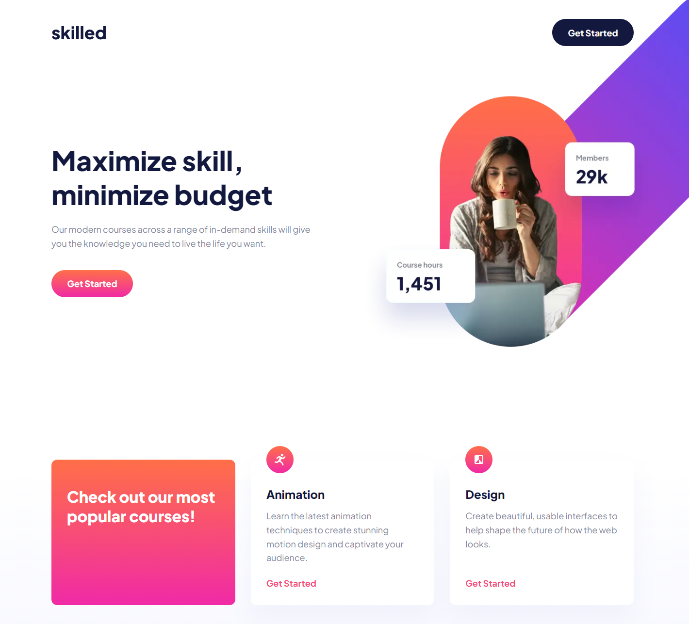
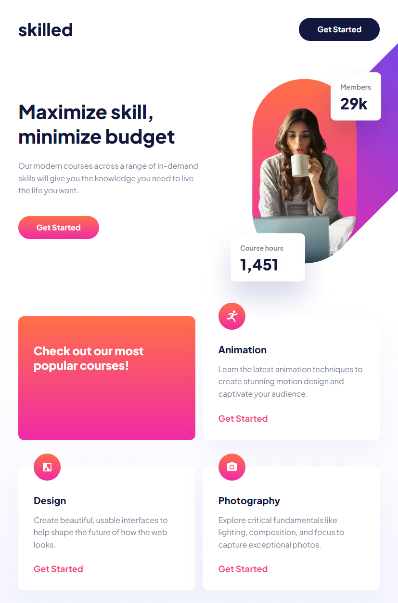
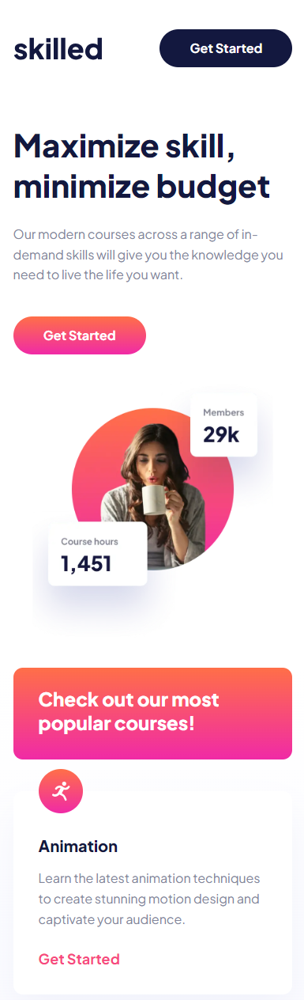

# Frontend Mentor - Skilled e-learning landing page solution

This is a solution to
the [Skilled e-learning landing page challenge on Frontend Mentor](https://www.frontendmentor.io/challenges/skilled-elearning-landing-page-S1ObDrZ8q).
Frontend Mentor challenges help you improve your coding skills by building realistic projects.

## Table of contents

- [Overview](#overview)
    - [The challenge](#the-challenge)
    - [Screenshot](#screenshot)
    - [Links](#links)
- [My process](#my-process)
    - [Built with](#built-with)
    - [What I learned](#what-i-learned)
    - [Continued development](#continued-development)
    - [Useful resources](#useful-resources)
- [Author](#author)

## Overview

### The challenge

Users should be able to:

- View the optimal layout depending on their device's screen size
- See hover states for interactive elements

### Screenshot

# Desktop



# Tablet



# Mobile



### Links

- Solution URL: https://github.com/DenRisk/skilled
- Live Site URL: https://denrisk.github.io/skilled/

## My process

### Built with

- Semantic HTML5 markup
- SCSS
- Flexbox
- CSS Grid
- Mobile-first workflow
- [React](https://reactjs.org/) - JS library

### What I learned

I learned how to build a page layout with grid. So we dont need to use a container class.v


```scss
.content-grid {
  display: grid;
  grid-template-columns:
    [full-width-start] minmax(clamp(1rem, 5vw, 4rem), 1fr)
    [breakout-start] minmax(0, 1500px)
    [content-start] min(100% - (clamp(1rem, 5vw, 4rem) * 2), 1200px) [content-end]
    minmax(0, 1500px) [breakout-end]
    minmax(clamp(1rem, 5vw, 4rem), 1fr) [full-width-end];
}
```

### Continued development

Continue Focusing:
- Elements with position absolute/relative
- Responsive Design

### Useful resources

https://ryanmulligan.dev/blog/layout-breakouts/

## Author

- Frontend Mentor - https://www.frontendmentor.io/profile/DenRisk

